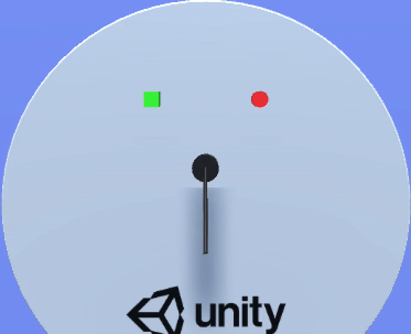

# LLM-Enhanced Robotics Manipulation
Using LLM (Google Gemini 1.0 pro vision) to guide the movement of da Vinci Research Kit (dVRK) endowrist (represented as a bar/stick).\
The significance of this project lies in the possible later extension of this project by using VR/AR to virtualize the da Vinci Research Kit (dVRK) endowrist as our bar so that although dVRK endowrist is in execution in reality, we can still simply execute this program to manipulate it.

## LLMRoboticsProject
This is the file containing the Unity project and code script
- Asset is the project asset, Script folder inside it containing codes

## Codes
- GeminiTestRequest.cs, GeminiTextResponse.cs AIHttpClients.cs are Gemini Driving code
- BarMover.cs the main project code
- BarController.cs, Utilities.cs code for moving objects and LLM prompt

# Setup Requirements
- Download and open Unity Hub at https://unity.com/download
- Install Unity version 2022.3.19f1 in Install -> Install Editor -> Official Releases
- Create a Google Cloud account at https://cloud.google.com/vertex-ai?hl=en 
- Go to Asset/Scripts/AIHttpClients.cs/MyRegion
- Change the PROJECT_ID to your project ID
- Modify MODEL_ID and QUERY based on your needs
- please look at Asset/Script/AIHttpClients.cs on how to modify

# Acknowledgements And Modifications
- The setup of this project is based on Unity Robotics Hub -> Pick and Place Tutorial. The link is here:
    https://github.com/Unity-Technologies/Unity-Robotics-Hub/tree/main/tutorials/pick_and_place
- The Connection to Google Vertex AI is extracted as another stand-alone project. If you are interested please see the link below:
  https://github.com/david-wei-01001/CSharp-Unity-to-Google-Vertex-AI
- The Network connection with Gemini is based on the following repo with significant changes:
    https://github.com/jackcodewu/GeminiAI.Net

- Changes:
    1. The original repo will connect to Google Gemini, but Gemini is not available in many countries, and people have to connect with Google Vertex AI. This project rewrites the network connection part to auto-generate credentials and connect to Google Vertex AI
    2. The original repo only allows passing in one part, a text-based prompt. This project has rewritten the input logic so it can take as many parts as wanted and also able to take in images as input
    3. Please look at Asset/Script/GeminiTestRequest.cs for details of how to pass in other forms of data (eg. files on the cloud, videos, functions, etc.)
    4. Provide all necessary Plugins to complete the connection (see Asset/Plugins folder)
